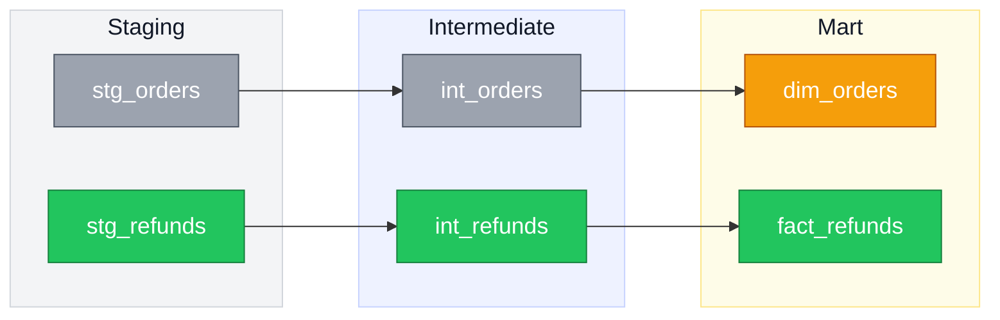
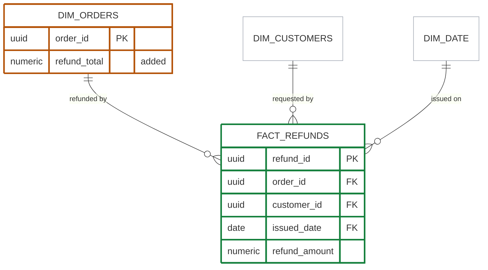

# claude-tools

Personal [Claude Code](https://claude.com/claude-code) skills.

## [`mermaid-diagrams`](skills/mermaid-diagrams/SKILL.md)

Mermaid ERDs and lineage DAGs with a consistent color language: **green for new, amber for changed, gray for untouched** — filled nodes in DAGs, outlined entities in ERDs. Built primarily for pull request descriptions — a reviewer should see the shape of a change before reading a line of the diff — but it works just as well for architecture docs, onboarding material, and design proposals.

### Lineage DAG

A PR adding refund tracking: a new model at each layer, plus an existing dimension that gains a refund column.



<details>
<summary>Source</summary>

````
%%{init: {'themeVariables': {'fontSize':'18px'}, 'flowchart': {'nodeSpacing':50,'rankSpacing':60}}}%%
flowchart LR
    classDef newNode fill:#22c55e,stroke:#15803d,color:#fff
    classDef changedNode fill:#f59e0b,stroke:#b45309,color:#fff
    classDef existingNode fill:#9ca3af,stroke:#4b5563,color:#fff

    subgraph staging[Staging]
        stg_orders["stg_orders"]:::existingNode
        stg_refunds["stg_refunds"]:::newNode
    end

    subgraph intermediate[Intermediate]
        int_orders["int_orders"]:::existingNode
        int_refunds["int_refunds"]:::newNode
    end

    subgraph mart[Mart]
        dim_orders["dim_orders"]:::changedNode
        fact_refunds["fact_refunds"]:::newNode
    end

    style staging fill:#f3f4f6,stroke:#d1d5db,color:#111827
    style intermediate fill:#eef2ff,stroke:#c7d2fe,color:#111827
    style mart fill:#fefce8,stroke:#fde68a,color:#111827

    stg_orders --> int_orders --> dim_orders
    stg_refunds --> int_refunds --> fact_refunds
````

</details>

### ERD

The same change as a star schema — real crow's-foot cardinality, with attributes spelled out only for the two entities under review. ERDs carry state in the border rather than the fill, so the attribute text stays readable.



<details>
<summary>Source</summary>

````
%%{init: {'themeVariables': {'fontSize':'18px'}}}%%
erDiagram
    classDef newNode      fill:#ffffff,stroke:#15803d,stroke-width:3px
    classDef changedNode  fill:#ffffff,stroke:#b45309,stroke-width:3px
    classDef existingNode fill:#ffffff,stroke:#9ca3af,stroke-width:1px

    DIM_ORDERS    ||--o{ FACT_REFUNDS : "refunded by"
    DIM_CUSTOMERS ||--o{ FACT_REFUNDS : "requested by"
    DIM_DATE      ||--o{ FACT_REFUNDS : "issued on"

    FACT_REFUNDS {
        uuid refund_id PK
        uuid order_id FK
        uuid customer_id FK
        date issued_date FK
        numeric refund_amount
    }
    DIM_ORDERS {
        uuid order_id PK
        numeric refund_total "added"
    }

    FACT_REFUNDS:::newNode
    DIM_ORDERS:::changedNode
    DIM_CUSTOMERS:::existingNode
    DIM_DATE:::existingNode
````

</details>

### Using it

Ask directly ("diagram this migration") or just let it fire — it triggers on "show the DAG," "draw the ERD," and on PR descriptions involving a schema change or new pipeline stage.

Beyond the color convention, it encodes the fiddly parts of Mermaid that are easy to get wrong:

- `erDiagram` accepts `classDef` in Mermaid 11+, so colored ERDs keep real crow's-foot cardinality — no need to fake one with a flowchart
- ERDs need an explicit `fill:#ffffff` and no `color:` — Mermaid zebra-stripes attribute rows with your fill, and omitting fill lets a default lavender header band through
- Subgraph titles render white by default, invisible in GitHub dark mode, until you set `color:` explicitly
- `fontSizeCluster` isn't a real theme variable, so subgraph title size needs a `classDef`
- Diagrams shrink as they get busier; font size and `useMaxWidth: false` are the levers that fight back
- Subgraphs cost padding, so there's a node-count threshold for when they're worth it

The examples use dbt and Kimball naming, but nothing in the skill is dbt-specific — the same conventions apply to service architectures, module dependency graphs, or database schemas.

## Install

Copy a skill into your global skills dir to use it in every project:

```bash
cp -R skills/mermaid-diagrams ~/.claude/skills/
```

Or into a single project:

```bash
cp -R skills/mermaid-diagrams /path/to/project/.claude/skills/
```

Claude Code picks up skills from `~/.claude/skills/` (global) and `.claude/skills/` (per-project). No restart needed.
