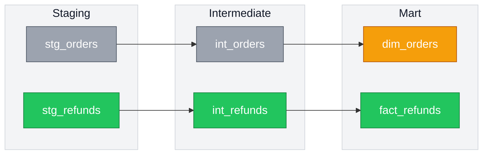

# claude-tools

Personal [Claude Code](https://claude.com/claude-code) skills.

| Skill | What it does |
|---|---|
| [`mermaid-diagrams`](skills/mermaid-diagrams/) | Mermaid ERDs and lineage DAGs that color-code new vs. changed vs. untouched, for PR descriptions and architecture docs. |

## mermaid-diagrams

Green for new, amber for changed, gray for untouched — so a reviewer sees the shape of a change before reading a line of the diff.



**[See the ERD example and full details →](skills/mermaid-diagrams/)**

## Install

Copy a skill into your global skills dir to use it in every project:

```bash
cp -R skills/mermaid-diagrams ~/.claude/skills/
```

Or into a single project:

```bash
cp -R skills/mermaid-diagrams /path/to/project/.claude/skills/
```

Claude Code picks up skills from `~/.claude/skills/` (global) and `.claude/skills/` (per-project). No restart needed.

## License

[MIT](LICENSE) — use it however you like.
