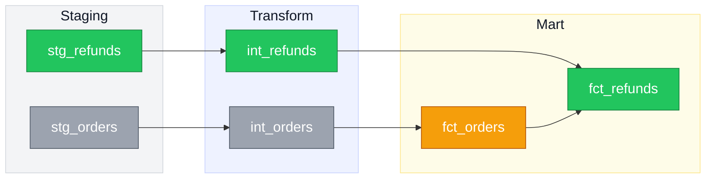
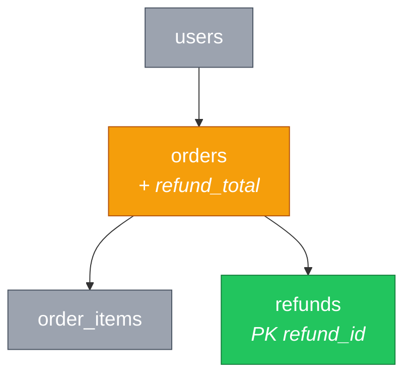

# claude-tools

Personal [Claude Code](https://claude.com/claude-code) skills.

## [`mermaid-diagrams`](skills/mermaid-diagrams/SKILL.md)

Mermaid ERDs and DAGs with a consistent color language: **green for new, amber for changed, gray for untouched.** Built primarily for pull request descriptions — a reviewer should see the shape of a change before reading a line of the diff — but it works just as well for architecture docs, onboarding material, and design proposals.

### Lineage DAG

A PR adding refund tracking: two new models, one existing model gains refund columns, the rest is context.



<details>
<summary>Source</summary>

````
%%{init: {'themeVariables': {'fontSize':'20px'}, 'flowchart': {'nodeSpacing':50,'rankSpacing':60}}}%%
flowchart LR
    classDef newNode fill:#22c55e,stroke:#15803d,color:#fff
    classDef changedNode fill:#f59e0b,stroke:#b45309,color:#fff
    classDef existingNode fill:#9ca3af,stroke:#4b5563,color:#fff

    subgraph staging[Staging]
        stg_orders["stg_orders"]:::existingNode
        stg_refunds["stg_refunds"]:::newNode
    end

    subgraph transform[Transform]
        int_orders["int_orders"]:::existingNode
        int_refunds["int_refunds"]:::newNode
    end

    subgraph mart[Mart]
        fct_orders["fct_orders"]:::changedNode
        fct_refunds["fct_refunds"]:::newNode
    end

    style staging fill:#f3f4f6,stroke:#d1d5db,color:#111827
    style transform fill:#eef2ff,stroke:#c7d2fe,color:#111827
    style mart fill:#fefce8,stroke:#fde68a,color:#111827

    stg_orders --> int_orders --> fct_orders
    stg_refunds --> int_refunds --> fct_refunds
    fct_orders --> fct_refunds
````

</details>

### ERD

Same change as a schema diagram. The columns that matter to the review go in the node label; everything else stays out.



<details>
<summary>Source</summary>

````
%%{init: {'themeVariables': {'fontSize':'20px'}, 'flowchart': {'nodeSpacing':50,'rankSpacing':60}}}%%
flowchart TD
    classDef newNode fill:#22c55e,stroke:#15803d,color:#fff
    classDef changedNode fill:#f59e0b,stroke:#b45309,color:#fff
    classDef existingNode fill:#9ca3af,stroke:#4b5563,color:#fff

    USERS["users"]:::existingNode
    ORDERS["orders<br/><i>+ refund_total</i>"]:::changedNode
    ORDER_ITEMS["order_items"]:::existingNode
    REFUNDS["refunds<br/><i>PK refund_id</i>"]:::newNode

    USERS --> ORDERS
    ORDERS --> ORDER_ITEMS
    ORDERS --> REFUNDS
````

</details>

ERDs use `flowchart` rather than `erDiagram` because `erDiagram` ignores per-node color. When you want true crow's-foot cardinality and don't need color, the skill falls back to real `erDiagram` syntax and says so.

### Using it

Ask directly ("diagram this migration") or just let it fire — it triggers on "show the DAG," "draw the ERD," and on PR descriptions involving a schema change or new pipeline stage.

Beyond the color convention, it encodes the fiddly parts of Mermaid that are easy to get wrong:

- Colored ERDs need `flowchart` syntax, because `erDiagram` ignores per-node styling
- Subgraph titles render white by default — invisible in GitHub dark mode until you set `color:` explicitly
- `fontSizeCluster` isn't a real theme variable, so subgraph title size needs a `classDef`
- Diagrams shrink as they get busier; font size and `useMaxWidth: false` are the levers that fight back
- Subgraphs cost padding, so there's a node-count threshold for when they're worth it

The examples use dbt-style naming, but nothing in the skill is dbt-specific — the same conventions apply to service architectures, module dependency graphs, or database schemas.

## Install

Copy a skill into your global skills dir to use it in every project:

```bash
cp -R skills/mermaid-diagrams ~/.claude/skills/
```

Or into a single project:

```bash
cp -R skills/mermaid-diagrams /path/to/project/.claude/skills/
```

Claude Code picks up skills from `~/.claude/skills/` (global) and `.claude/skills/` (per-project). No restart needed.
