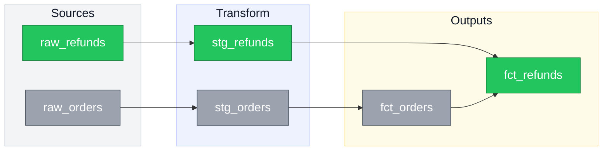

# claude-tools

Personal [Claude Code](https://claude.com/claude-code) skills.

## Skills

### [`mermaid-diagrams`](skills/mermaid-diagrams/SKILL.md)

Teaches Claude to draw Mermaid ERDs and DAGs with a consistent color language: **green for what's new, gray for what already existed**. Built primarily for pull request descriptions — a reviewer should be able to see the shape of a change before reading a line of the diff — but it works just as well for architecture docs, onboarding material, and design proposals.

Ask for it directly ("diagram this migration") or just let it fire — it triggers on "show the DAG," "draw the ERD," and on PR descriptions involving a schema change or new pipeline stage.

Beyond the color convention, it encodes the fiddly parts of Mermaid that are easy to get wrong:

- Colored ERDs need `flowchart` syntax, because `erDiagram` ignores per-node styling
- Subgraph titles render white by default — invisible in GitHub dark mode until you set `color:` explicitly
- `fontSizeCluster` isn't a real theme variable, so subgraph title size needs a `classDef`
- Diagrams shrink as they get busier; font size and `useMaxWidth: false` are the levers that fight back

#### Sample output

A pull request adding refund tracking to an existing orders pipeline:



<details>
<summary>Source for the diagram above</summary>

````
%%{init: {'themeVariables': {'fontSize':'20px'}, 'flowchart': {'nodeSpacing':50,'rankSpacing':60}}}%%
flowchart LR
    classDef newNode fill:#22c55e,stroke:#15803d,color:#fff
    classDef existingNode fill:#9ca3af,stroke:#4b5563,color:#fff

    subgraph sources[Sources]
        raw_orders["raw_orders"]:::existingNode
        raw_refunds["raw_refunds"]:::newNode
    end

    subgraph transform[Transform]
        stg_orders["stg_orders"]:::existingNode
        stg_refunds["stg_refunds"]:::newNode
    end

    subgraph outputs[Outputs]
        fct_orders["fct_orders"]:::existingNode
        fct_refunds["fct_refunds"]:::newNode
    end

    style sources fill:#f3f4f6,stroke:#d1d5db,color:#111827
    style transform fill:#eef2ff,stroke:#c7d2fe,color:#111827
    style outputs fill:#fefce8,stroke:#fde68a,color:#111827

    raw_orders --> stg_orders --> fct_orders
    raw_refunds --> stg_refunds --> fct_refunds
    fct_orders --> fct_refunds
````

</details>

The examples here use dbt-style naming, but nothing in the skill is dbt-specific — the same conventions apply to service architectures, module dependency graphs, or database schemas.

## Install

Copy a skill into your global skills dir to use it in every project:

```bash
cp -R skills/mermaid-diagrams ~/.claude/skills/
```

Or into a single project:

```bash
cp -R skills/mermaid-diagrams /path/to/project/.claude/skills/
```

Claude Code picks up skills from `~/.claude/skills/` (global) and `.claude/skills/` (per-project). No restart needed.
