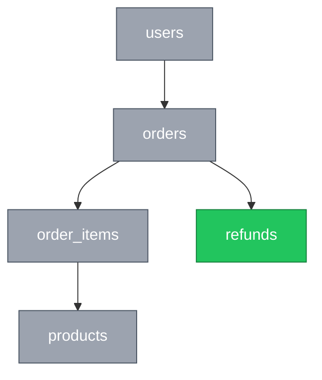
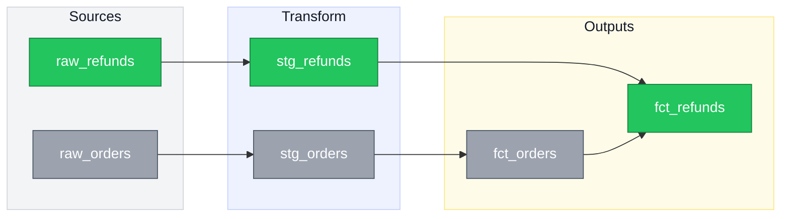

# Mermaid Diagrams (New vs. Existing convention)

Generates Mermaid ERDs and DAGs for PRs and docs, using a consistent color language so reviewers can tell new work from existing structure at a glance.

## When to use this

- User asks to diagram a data model, entity relationship, service architecture, dependency graph, or pipeline flow
- User is drafting a PR description for a schema change, migration, or new pipeline stage
- User says "diagram this," "show the DAG," "draw the ERD," etc., even without mentioning Mermaid explicitly

## Color convention

Always define these two classes at the top of every diagram:

```
classDef newNode fill:#22c55e,stroke:#15803d,color:#fff
classDef existingNode fill:#9ca3af,stroke:#4b5563,color:#fff
```

- **Green (`newNode`)** = new in this PR/migration
- **Gray (`existingNode`)** = pre-existing, unchanged

Tag every node with `:::newNode` or `:::existingNode`. Don't leave nodes untagged — an unstyled node in a diagram that otherwise uses this convention reads as ambiguous, not neutral.

### Subgraph backgrounds

When grouping nodes into a `subgraph` (e.g. a pipeline stage, a service boundary, a domain), give the subgraph itself a **muted, low-saturation background** — not the bright green/gray used for individual nodes, since a bright background behind bright nodes gets visually noisy and makes it harder to tell which color signals "new/existing" vs. "grouping."

**Always set `color:#111827` on the subgraph style.** Subgraph titles otherwise inherit the theme's text color, which renders white — invisible against a light background, and unreadable in GitHub dark mode.

```
style sources fill:#f3f4f6,stroke:#d1d5db,color:#111827
style transform fill:#eef2ff,stroke:#c7d2fe,color:#111827
style outputs fill:#fefce8,stroke:#fde68a,color:#111827
```

Pick a distinct muted tone per group (light gray, light indigo, light amber, etc.) so groups are visually separable without competing with the new/existing node colors.

## ERD pattern

`erDiagram` does **not** support per-node color styling in current Mermaid versions. For a colored ERD, use flowchart syntax styled to read like an entity diagram instead:



If the user specifically wants true `erDiagram` cardinality notation (`||--o{`, etc.) and doesn't need color, use standard `erDiagram` syntax instead — flag the styling tradeoff so they can choose.

## DAG pattern



- Use `subgraph` groupings for any DAG with 15+ nodes rather than letting Mermaid's auto-layout handle it flat.
- Use `flowchart LR` for pipeline/lineage flow (left-to-right reads naturally as "upstream → downstream"); use `flowchart TD` for ERDs (top-down reads more like a schema diagram).

## No legend

Do not add a legend subgraph. It's visually ugly, eats render area, and green-means-new is self-evident from context. State the convention in the caption line instead if it needs saying at all.

## Label subgraphs by boundary

When a diagram spans more than one repo, service, or architecture layer, name each subgraph for the **boundary it represents** — the repo or service name — not just an abstract stage. Reviewers need to know which codebase a node lives in; that's what tells them where to look.

**No caption under the diagram.** Don't restate what the boxes group or what the colors mean — the subgraph title already says it.

Subgraph titles render large by default, and **theme variables do not control their size** — `fontSizeCluster` is not a real Mermaid variable and is silently ignored. Use a `classDef` with `font-size` applied to the subgraph id:

```
classDef grp fill:#eef2ff,stroke:#c7d2fe,color:#374151,font-size:11px
class api grp
class worker grp
```

Label subgraphs with the **repo or service name only** — `api`, not `api · Postgres · request handling`. Mermaid centers cluster titles with no alignment option, so keep them short enough that centering isn't noticeable.

Boundary-labeled subgraphs cost render area, so only use them when a change actually crosses a boundary. Single-repo diagrams get no subgraph at all.

## Render size

GitHub scales the SVG to the container width, so nodes shrink as the diagram gets wider or busier. To make a diagram render larger and reduce scrolling:

1. **Bump the font size** via an `init` directive on the first line. This is the most direct lever — node boxes size to their text. Use 24–28px for a small diagram; GitHub scales the SVG to container width, so a bigger font means bigger boxes, not overflow.

```
%%{init: {'themeVariables': {'fontSize':'26px'}}}%%
flowchart LR
```

Also set generous node/rank spacing so boxes don't crowd:

```
%%{init: {'themeVariables': {'fontSize':'26px'}, 'flowchart': {'nodeSpacing':60,'rankSpacing':70,'useMaxWidth':false}}}%%
```

`useMaxWidth: false` stops Mermaid from shrinking the SVG to fit — it renders at natural size and GitHub gives it the full column.

2. **Cut node count and shorten labels.** Eight nodes across three subgraphs renders much smaller than five nodes with no subgraphs. Drop nodes that don't carry meaning for the change being shown.
3. **Prefer `LR` for wide screens, `TD` when there are few nodes** — a tall diagram uses the full container width per node; a wide one divides it.
4. **Skip subgraphs when there are under ~6 nodes.** The grouping boxes add padding that shrinks the nodes inside.
5. Use `<br/>` inside a label rather than one long string, so nodes stay squarer and text stays legible.

## Rendering notes

- GitHub and GitLab both render `classDef`/`class`/`style` directives natively in Mermaid code fences — no plugin needed.
- Some older Confluence Mermaid plugins lag behind current Mermaid syntax versions; if the diagram is going into Confluence, verify `classDef` support first or fall back to plain colored shapes via inline `style nodeId fill:#...` on each node.
- Keep entity attribute lists short in ERDs (PK/FK + one or two key fields) — full column lists get visually noisy fast, especially once color is added on top.
