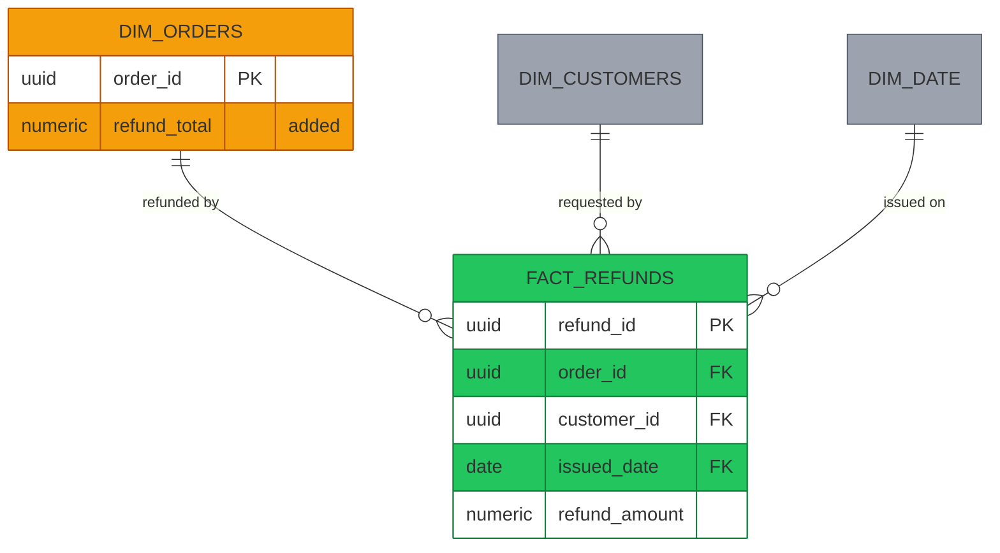
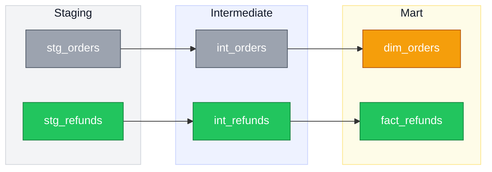

# Mermaid Diagrams (New vs. Existing convention)

Generates Mermaid ERDs and DAGs for PRs and docs, using a consistent color language so reviewers can tell new work from existing structure at a glance.

## When to use this

- User asks to diagram a data model, entity relationship, service architecture, dependency graph, or pipeline flow
- User is drafting a PR description for a schema change, migration, or new pipeline stage
- User says "diagram this," "show the DAG," "draw the ERD," etc., even without mentioning Mermaid explicitly

## Color convention

Define these classes at the top of every diagram:

```
classDef newNode fill:#22c55e,stroke:#15803d,color:#fff
classDef changedNode fill:#f59e0b,stroke:#b45309,color:#fff
classDef existingNode fill:#9ca3af,stroke:#4b5563,color:#fff
```

| Class | Color | Meaning |
|---|---|---|
| `newNode` | green | Created in this PR/migration — didn't exist before |
| `changedNode` | amber | Already existed, but this PR modifies it |
| `existingNode` | gray | Pre-existing and untouched — context only |

Tag every node with one of the three. Don't leave nodes untagged — an unstyled node in a diagram that otherwise uses this convention reads as ambiguous, not neutral.

Omit `changedNode` from the `classDef` block when nothing is being modified; a declared-but-unused class is noise. The distinction between amber and gray is what tells a reviewer where to look, so it's worth being precise: a table that gains a column is `changedNode`, a table merely referenced for context is `existingNode`.

The `color:#fff` above is for **flowcharts only**. In `erDiagram`, drop it — see the ERD section.

### Subgraph backgrounds

When grouping nodes into a `subgraph` (e.g. a pipeline stage, a service boundary, a domain), give the subgraph itself a **muted, low-saturation background** — not the bright green/gray used for individual nodes, since a bright background behind bright nodes gets visually noisy and makes it harder to tell which color signals "new/existing" vs. "grouping."

**Always set `color:#111827` on the subgraph style.** Subgraph titles otherwise inherit the theme's text color, which renders white — invisible against a light background, and unreadable in GitHub dark mode.

```
style sources fill:#f3f4f6,stroke:#d1d5db,color:#111827
style transform fill:#eef2ff,stroke:#c7d2fe,color:#111827
style outputs fill:#fefce8,stroke:#fde68a,color:#111827
```

Pick a distinct muted tone per group (light gray, light indigo, light amber, etc.) so groups are visually separable without competing with the new/existing node colors.

## ERD pattern

Use real `erDiagram` syntax with crow's-foot notation. Mermaid 11 supports `classDef` and `:::` on entities, so you get cardinality **and** color — don't fake an ERD with a flowchart.

**Omit `color:` from ERD classDefs.** Setting `color:#fff` (as the DAG classes do) forces white text into the attribute rows, which have white backgrounds — the attributes become invisible. Let the attribute text default to dark.

Declare entity classes after the relationships, one per line:



Cardinality carries real information — use it rather than plain arrows. `||--o{` is one-to-many, `}o--o{` many-to-many, `||--||` one-to-one.

**Only spell out attributes for entities the change touches.** A new fact gets its PK, FKs, and measures; a changed dimension gets its PK plus the added column, tagged with a `"added"` comment. Untouched context entities get no attribute block at all — that's what keeps the diagram readable, and the empty box reads correctly as "nothing to review here."

For dimensional models, put the fact at the center and the dimensions around it; `erDiagram` has no direction control, so entity declaration order is the only layout lever.

## DAG pattern



- Use `flowchart LR` for pipeline/lineage flow — left-to-right reads naturally as "upstream → downstream." Lineage DAGs are the flowchart use case; ERDs use `erDiagram` instead.

### When to use subgraphs

Subgraph boxes add padding that shrinks the nodes inside, so they have to earn the space:

| Nodes | Use subgraphs? |
|---|---|
| Under ~6 | No — the grouping costs more than it clarifies |
| ~6–15 | Only if the diagram crosses a repo/service boundary |
| 15+ | Yes — group them rather than letting auto-layout sprawl |

## No legend, no caption

Do not add a legend subgraph, and do not write a caption under the diagram. Legends eat render area; captions restate what the boxes and colors already say. Green-means-new is self-evident from context. If the convention genuinely needs stating, one short sentence in the surrounding prose is enough.

## Label subgraphs by boundary

When a diagram spans more than one repo, service, or architecture layer, name each subgraph for the **boundary it represents** — the repo or service name — not just an abstract stage. Reviewers need to know which codebase a node lives in; that's what tells them where to look.

Subgraph titles render large by default, and **theme variables do not control their size** — `fontSizeCluster` is not a real Mermaid variable and is silently ignored. Use a `classDef` with `font-size` applied to the subgraph id:

```
classDef grp fill:#eef2ff,stroke:#c7d2fe,color:#374151,font-size:11px
class api grp
class worker grp
```

Label subgraphs with the **repo or service name only** — `api`, not `api · Postgres · request handling`. Mermaid centers cluster titles with no alignment option, so keep them short enough that centering isn't noticeable.

Boundary-labeled subgraphs cost render area, so only use them when a change actually crosses a boundary. Single-repo diagrams get no subgraph at all.

## Render size

GitHub scales the SVG to the container width, so nodes shrink as the diagram gets wider or busier. To make a diagram render larger and reduce scrolling:

1. **Bump the font size** via an `init` directive on the first line. This is the most direct lever — node boxes size to their text. Use 24–28px for a small diagram; GitHub scales the SVG to container width, so a bigger font means bigger boxes, not overflow.

```
%%{init: {'themeVariables': {'fontSize':'26px'}}}%%
flowchart LR
```

Also set generous node/rank spacing so boxes don't crowd:

```
%%{init: {'themeVariables': {'fontSize':'26px'}, 'flowchart': {'nodeSpacing':60,'rankSpacing':70,'useMaxWidth':false}}}%%
```

`useMaxWidth: false` stops Mermaid from shrinking the SVG to fit — it renders at natural size and GitHub gives it the full column.

2. **Cut node count and shorten labels.** Eight nodes across three subgraphs renders much smaller than five nodes with no subgraphs. Drop nodes that don't carry meaning for the change being shown.
3. **Prefer `LR` for wide screens, `TD` when there are few nodes** — a tall diagram uses the full container width per node; a wide one divides it.
4. Use `<br/>` inside a label rather than one long string, so nodes stay squarer and text stays legible.

## Rendering notes

- GitHub and GitLab both render `classDef`/`class`/`style` directives natively in Mermaid code fences — no plugin needed.
- `classDef` on `erDiagram` needs **Mermaid 11+**. GitHub is current, so it works there; older Confluence plugins and self-hosted GitLab may not be. If the target renderer is unknown, verify before relying on colored ERDs.
- Keep entity attribute lists short in ERDs (PK/FK + one or two key fields) — full column lists get visually noisy fast, especially once color is added on top.
- Verify a diagram renders before shipping it, rather than trusting that the syntax is right:

```bash
npx -p @mermaid-js/mermaid-cli mmdc -i diagram.mmd -o out.png -s 2
```
